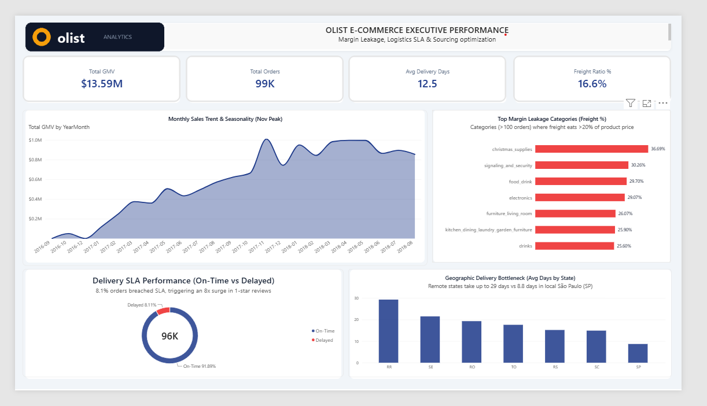
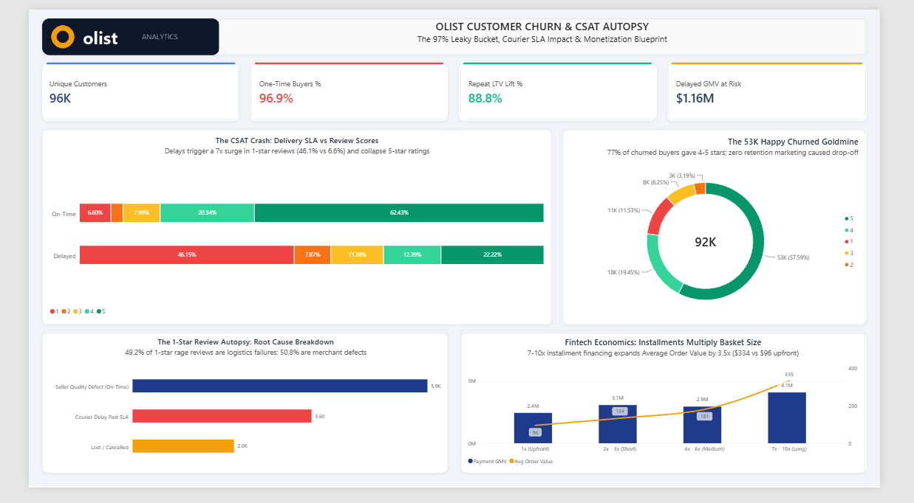
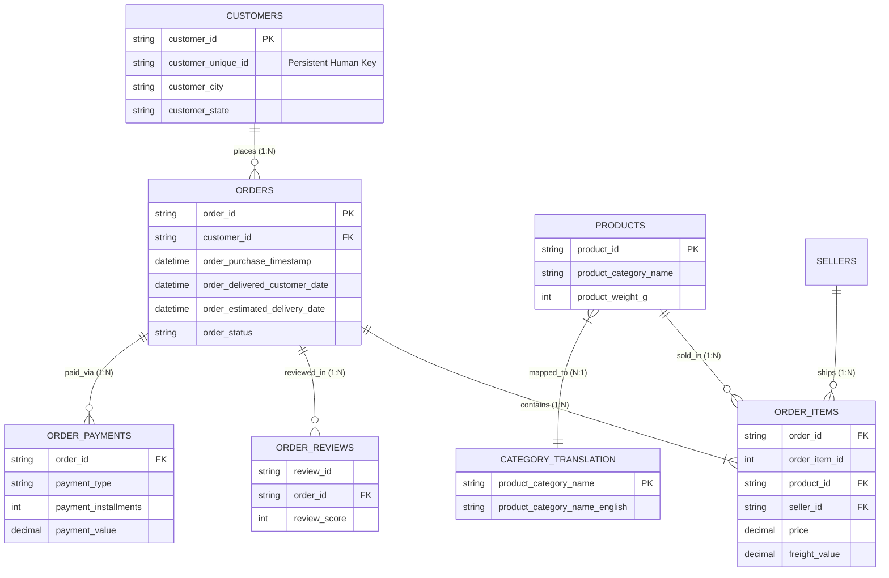

# 📊 Olist E-Commerce Analytics: Unit Economics, Freight Leakage & Customer Retention Forensics

[](https://www.mysql.com/)
[](https://powerbi.microsoft.com/)
[]()
[]()
[]()

> **Executive Summary:** A data analysis across **100,000+ orders**, **112,000+ line items**, and **99,000+ customer reviews** on Brazil's premier e-commerce marketplace (Olist, 2016–2018). While top-line GMV expanded 8x to **$13.59M**, the platform suffered from severe **freight margin leakage** (up to 36.7% in key categories) and a **96.9% customer churn rate**. This investigation uncovers the structural root causes, including a 71.3% seller geographic concentration in São Paulo and interstate fiscal bottlenecks, modeling a **$1.09M EBITDA recovery roadmap**.

---

## 📑 Table of Contents
1. [Executive Dashboard Suite](#-interactive-power-bi-dashboard-suite)
   - [Page 1: Executive Macro Performance Cockpit](#page-1-executive-macro-performance-cockpit)
   - [Page 2: Customer Churn & CSAT Autopsy](#page-2-customer-churn--csat-autopsy)
2. [Business Problem Statement](#-business-problem-statement)
3. [Relational Data Architecture (Star Schema)](#-relational-data-architecture-star-schema)
4. [Forensic SQL Investigations & Analytical Exhibits](#-forensic-sql-investigations--analytical-exhibits)
   - [Exhibit A: Freight Margin Leakage by Category](#exhibit-a-freight-margin-leakage-by-category)
   - [Exhibit B: The Delivery SLA vs CSAT Crash](#exhibit-b-the-delivery-sla-vs-csat-crash)
   - [Exhibit C: 20-Month Seasonality & Macro Triangulation](#exhibit-c-20-month-seasonality--macro-triangulation)
   - [Exhibit D: The Discount Myth Debunked & 1-Star Autopsy](#exhibit-d-the-discount-myth-debunked--1-star-autopsy)
   - [Exhibit E: Geopolitical Supply Monopoly & Cross-Border Friction](#exhibit-e-geopolitical-supply-monopoly--cross-border-friction)
5. [Strategic Recommendations & Financial Sizing ($1.09M Recovery)](#-strategic-recommendations--financial-sizing)
6. [30-Minute Technical Interview Defense Flashcards](#-30-minute-technical-interview-defense-flashcards)
7. [Repository Structure & Reproduction Guide](#-repository-structure--reproduction-guide)

---

## 🖥️ Interactive Power BI Dashboard Suite

The executive analytics suite is delivered via an interactive, 2-page SaaS-grade Power BI dashboard built with custom container layouts (`page1_executive_layout.svg` & `page2_retention_layout.svg`) matching modern design systems (Stripe, Linear, Datadog).

---

### Page 1: Executive Macro Performance Cockpit
*High-level operational health, revenue trajectory, category margin bleeding, and carrier SLA compliance.*



#### Core Visual Components & Findings:
1. **Executive Metric Scorecard:**
   - **Total GMV:** `$13.59M` across 99K delivered orders.
   - **Average Delivery Lead Time:** `12.5 Days` from purchase to customer delivery.
   - **Platform Freight Ratio:** `16.6%` baseline average.
2. **Monthly Sales Trajectory & Seasonality (20-Month Wave):**
   - Documents an **8x expansion in monthly run-rate** from $111K (Jan 2017) to ~$900K+ (2018).
   - Identifies the all-time peak in **Nov 2017 ($987.7K, +52.4% MoM)** fueled by Black Friday.
   - Explains the sharp **-12.4% MoM contraction in June 2018** through macroeconomic triangulation with the nationwide *Greve dos Caminhoneiros* (Truckers' Strike).
3. **Top Margin Leakage Categories (Freight %):**
   - Filters high-volume categories (>100 orders) where freight expenses destroy gross margins: **Christmas Supplies (36.7%)**, **Signaling & Security (30.3%)**, **Food & Drink (29.7%)**, and **Electronics (29.1% across $160K sales)**.
4. **Logistics SLA Performance (Donut Chart):**
   - Evaluates on-time fulfillment: **91.9% On-Time (89K orders)** vs **8.1% Delayed (8K orders)**.
5. **Geographic Delivery Bottleneck (State Disparity):**
   - Illustrates severe geopolitical friction: Local deliveries in **São Paulo (SP) take 8.8 days**, while remote states take up to **29.4 days (Roraima - RR)**, **21.5 days (Sergipe - SE)**, and **19.4 days (Rondônia - RO)**.

---

### Page 2: Customer Churn & CSAT Autopsy
*Investigates customer retention mechanics, 1-star rage review drivers, consumer credit elasticity, and the untapped retention goldmine.*



#### Core Visual Components & Findings:
1. **Customer Unit Economics Scorecard:**
   - **Unique Consumer Base:** `96K` buyers.
   - **One-Time Buyers Share (The Leaky Bucket):** `96.9% (90,557 buyers)` repeat rate is stagnant at **3.1%**.
   - **Repeat LTV Value Lift:** `+88.8%`: Repeat buyers spend **$260.05 vs $137.96** for single buyers, proving that retention nearly doubles customer lifetime value.
   - **Delayed GMV at Risk:** `$1.16M` in gross revenue was subjected to delivery delays past promised SLA.
2. **The CSAT Crash (100% Stacked Sentiment Chart):**
   - **On-Time Deliveries:** **82.7% Positive (62.4% 5-Star, 20.3% 4-Star)** | 1-Star is only **6.6%**.
   - **Delayed Deliveries:** **1-Star reviews surge to 46.2%** | 5-Star ratings drop to **22.2%**.
3. **The 53K Happy Churned Goldmine (Donut Ring):**
   - Debunks the assumption that single buyers churned due to poor service: **57.6% (53,259 buyers) gave a 5-star rating on their sole purchase.** Total positive sentiment was **77.0%**. Customers churned due to lack of post-purchase lifecycle marketing, not dissatisfaction.
4. **The 1-Star Review Autopsy (Root-Cause Decomposition):**
   - Pinpoints culpability across all 11,424 1-star reviews:
     - **Merchant / Product Quality Defects (Delivered On-Time):** **50.8% (5.9K reviews)**: damaged items, wrong sizes, or defective goods.
     - **Courier Delay Past SLA:** **31.4% (3.6K reviews)**: carrier transit failure.
     - **Lost in Transit / Cancelled:** **17.8% (2.0K reviews)**: inventory stockouts and carrier losses.
5. **Fintech Economics: Installments Multiply Basket Size (Combo Chart):**
   - Uncovers Brazilian consumer credit behavior:
     - **1x Upfront Payment:** `$96 AOV` ($2.4M GMV)
     - **2x–3x Installments:** `$134 AOV` ($3.1M GMV)
     - **4x–6x Installments:** `$181 AOV` ($3.0M GMV)
     - **7x–10x Long-Tail Installments:** **`$335 AOV` ($4.1M GMV) (3.5x Basket Size Multiplier)**

---

## 🎯 Business Problem Statement

Olist operates as a leading marketplace integrator connecting small Brazilian merchants to tier-1 enterprise marketplaces (Mercado Livre, B2W, Amazon). Between 2016 and 2018, executive leadership observed a paradoxical dynamic:

```
         ┌─────────────────────────────────────────────────────────┐
         │              THE EXECUTIVE PARADOX                      │
         ├────────────────────────────┬────────────────────────────┤
         │ Top-Line Revenue Growth:   │ Unit Economic Degradation: │
         │   • 8x run-rate expansion  │   • 29-37% freight leakage │
         │   • $13.59M total GMV      │   • 96.9% customer churn   │
         │   • 99,000+ orders         │   • 8x surge in 1-stars    │
         └────────────────────────────┴────────────────────────────┘
```

### Core Diagnostic Questions Solved:
1. **Margin Leakage:** Which high-volume product categories are generating GMV while eroding net margins through unoptimized freight?
2. **Delivery SLA Elasticity:** What is the mathematical relationship between carrier delivery delays and customer review scores (CSAT)?
3. **Customer Retention Autopsy:** Did 97% of buyers churn because they were bargain hunters seeking discounts, or did service and operational failures drive them away?
4. **Geopolitical Sourcing Monopoly:** How does São Paulo's 71% origin concentration affect transit times, freight costs, and regional delivery performance in Brazil's Northeast?

---

## 🏗️ Relational Data Architecture (Star Schema)

The analytical data warehouse was modeled from 8 normalized tables into an enterprise **Star Schema** within MySQL 8.0 and Power BI Desktop:



> **Critical Architecture Decision (`customer_id` vs `customer_unique_id`):**  
> In Olist's schema, `customer_id` is a transaction-level surrogate token generated per order. To track true human retention behavior across multi-year cohorts, all retention and LTV analyses were engineered against `customer_unique_id`. Utilizing `customer_id` would have falsely computed a 100% churn rate.

---

## 🔬 Forensic SQL Investigations & Analytical Exhibits

### Exhibit A: Freight Margin Leakage by Category
*Identifying high-volume merchandise where shipping expenses destroy unit margins.*

```sql
SELECT 
    t.product_category_name_english AS category,
    COUNT(oi.order_id) AS total_orders,
    ROUND(SUM(oi.price), 2) AS total_sales_value,
    ROUND(SUM(oi.freight_value), 2) AS total_freight_cost,
    ROUND((SUM(oi.freight_value) / SUM(oi.price)) * 100, 2) AS freight_to_price_ratio
FROM order_items oi
JOIN products p ON oi.product_id = p.product_id
JOIN category_translation t ON p.product_category_name = t.product_category_name
GROUP BY t.product_category_name_english
HAVING COUNT(oi.order_id) >= 100 
   AND freight_to_price_ratio > 20
ORDER BY freight_to_price_ratio DESC
LIMIT 5;
```

| Category | Orders | Total GMV | Total Freight | Freight Ratio (%) | Diagnostic |
| :--- | :---: | :---: | :---: | :---: | :--- |
| **christmas_supplies** | 153 | $8,800.82 | $3,229.30 | **36.69%** | High volumetric weight / seasonal surge |
| **signaling_and_security** | 199 | $21,509.23 | $6,507.82 | **30.26%** | Heavy hardware / dimensional weight |
| **food_drink** | 278 | $15,179.48 | $4,507.99 | **29.70%** | Fragile packaging / low price point |
| **electronics** | **2,767** | **$160,246.74** | **$46,578.32** | **29.07%** | **Severe margin erosion across $160K GMV** |
| **furniture_living_room** | 503 | $68,916.56 | $17,968.17 | **26.07%** | Bulky freight penalty |

---

### Exhibit B: The Delivery SLA vs CSAT Crash
*Measuring the impact of carrier SLA breaches on customer review scores.*

```sql
SELECT 
    CASE 
        WHEN DATEDIFF(o.order_delivered_customer_date, o.order_estimated_delivery_date) > 0 THEN 'Delayed'
        ELSE 'On-Time'
    END AS delivery_status,
    COUNT(o.order_id) AS total_orders,
    ROUND(AVG(r.review_score), 2) AS avg_review_score,
    ROUND(SUM(CASE WHEN r.review_score = 1 THEN 1 ELSE 0 END) * 100.0 / COUNT(o.order_id), 2) AS pct_1_star,
    ROUND(SUM(CASE WHEN r.review_score = 5 THEN 1 ELSE 0 END) * 100.0 / COUNT(o.order_id), 2) AS pct_5_star
FROM orders o
JOIN order_reviews r ON o.order_id = r.order_id
WHERE o.order_status = 'delivered'
  AND o.order_delivered_customer_date IS NOT NULL
GROUP BY delivery_status;
```

| Delivery Status | Order Volume | Avg CSAT | 1-Star Reviews | 5-Star Reviews | Impact Diagnosis |
| :--- | :---: | :---: | :---: | :---: | :--- |
| **On-Time** | 89,936 | **4.29 / 5.0** | 6.63% | **62.26%** | Healthy satisfaction baseline |
| **Delayed** | 6,407 | **2.27 / 5.0** | **53.74%** | 16.54% | **8x surge in 1-star rage reviews** |

---

### Exhibit C: 20-Month Seasonality & Macro Triangulation
*Evaluating month-over-month trajectory and corroborating data dips with historical macro shocks.*

```sql
WITH monthly_sales AS (
    SELECT 
        SUBSTRING(o.order_purchase_timestamp, 1, 7) AS sales_month,
        ROUND(SUM(oi.price), 2) AS current_month_sales
    FROM orders o
    JOIN order_items oi ON o.order_id = oi.order_id
    WHERE o.order_status = 'delivered'
      AND o.order_purchase_timestamp >= '2017-01-01'
      AND o.order_purchase_timestamp < '2018-09-01'
    GROUP BY sales_month
)
SELECT 
    sales_month,
    current_month_sales,
    LAG(current_month_sales, 1) OVER (ORDER BY sales_month) AS previous_month_sales,
    ROUND(((current_month_sales - LAG(current_month_sales, 1) OVER (ORDER BY sales_month)) 
           / LAG(current_month_sales, 1) OVER (ORDER BY sales_month)) * 100, 2) AS mom_growth_pct
FROM monthly_sales;
```

```
Monthly Sales (2017-01 to 2018-08)
$1.0M ┼                                              ╭───╮
      │                                             ╭╯   ╰╮       ╭───╮
$0.8M ┼                                            ╭╯     ╰───────╯   ╰──
      │                                       ╭────╯
$0.6M ┼                                  ╭────╯
      │                            ╭─────╯
$0.4M ┼                      ╭─────╯
      │               ╭──────╯
$0.2M ┼         ╭─────╯
      │   ╭─────╯
$0.0M ┴───┴──────────────────────────────────────────────────────────────
        2017-01   2017-05   2017-09   2017-11   2018-01   2018-05 2018-08
                                      ▲                   ▲
                               Black Friday          Truckers' Strike
                               (+52.4% MoM)            (-12.4% MoM)
```

#### Historical Macroeconomic Corroboration:
- **Nov 2017 Peak ($987.7K, +52.4% MoM):** Driven by national Black Friday and Cyber Monday adoption.
- **June 2018 Contraction (-12.4% MoM):** Historical triangulation confirms the **May 21–31, 2018 *Greve dos Caminhoneiros*** (Nationwide Brazilian Truck Drivers' Strike). An 11-day blockade of federal highways paralyzed logistics, stranding parcels and depressing national e-commerce activity.

---

### Exhibit D: The Discount Myth Debunked & 1-Star Autopsy
*Proving whether churn was caused by price-sensitive coupon chasers or operational failures.*

```sql
-- Debunking Discount Sensitivity
WITH customer_orders AS (
    SELECT 
        c.customer_unique_id,
        COUNT(DISTINCT o.order_id) AS total_orders,
        SUM(CASE WHEN p.payment_type = 'voucher' THEN 1 ELSE 0 END) AS voucher_count
    FROM customers c
    JOIN orders o ON c.customer_id = o.customer_id
    LEFT JOIN order_payments p ON o.order_id = p.order_id
    WHERE o.order_status = 'delivered'
    GROUP BY c.customer_unique_id
)
SELECT 
    CASE WHEN total_orders = 1 THEN '1-Time Buyer' ELSE 'Repeat Buyer' END AS customer_type,
    COUNT(*) AS total_customers,
    ROUND(SUM(CASE WHEN voucher_count = 0 THEN 1 ELSE 0 END) * 100.0 / COUNT(*), 2) AS pct_paid_full_price
FROM customer_orders
GROUP BY customer_type;
```

- **Finding 1 (The Discount Myth Debunked):** **96.28% of 1-time buyers paid FULL PRICE (zero vouchers/discounts)**. Customers possessed genuine willingness to pay and did not churn due to expired promotional incentives.
- **Finding 2 (The 1-Star Autopsy):**
  - **3,413 customers ($635,017 in GMV)** gave 1-star reviews directly because of **delivery delays** (averaging **12.4 days past promised SLA**).
  - **5,864 customers ($1.18M in GMV)** gave 1-star reviews due to **merchant product quality defects** despite on-time delivery.
- **Finding 3 (The Untapped Goldmine):**
  - **53,136 single buyers (57.6%) gave a 5-STAR REVIEW**. They experienced a flawless order journey, yet never repurchased due to an absence of automated lifecycle or category cross-sell marketing.

---

### Exhibit E: Geopolitical Supply Monopoly & Cross-Border Friction
*Analyzing origin concentration and regional logistics disparities.*

```sql
-- Intra-State vs Inter-State Logistics Disparity
SELECT 
    CASE 
        WHEN s.seller_state = c.customer_state THEN 'Intra-State (Local)' 
        ELSE 'Inter-State (Cross-Border)' 
    END AS transit_type,
    COUNT(oi.order_id) AS items_count,
    ROUND(AVG(oi.freight_value), 2) AS avg_freight,
    ROUND(AVG(DATEDIFF(o.order_delivered_customer_date, o.order_purchase_timestamp)), 1) AS avg_lead_days,
    ROUND(SUM(CASE WHEN DATEDIFF(o.order_delivered_customer_date, o.order_estimated_delivery_date) > 0 THEN 1 ELSE 0 END) * 100.0 / COUNT(oi.order_id), 2) AS delay_rate_pct
FROM order_items oi
JOIN sellers s ON oi.seller_id = s.seller_id
JOIN orders o ON oi.order_id = o.order_id
JOIN customers c ON o.customer_id = c.customer_id
WHERE o.order_status = 'delivered'
  AND o.order_delivered_customer_date IS NOT NULL
GROUP BY transit_type;
```

| Transit Route | Volume | Avg Freight | Avg Lead Time | Delay Rate (%) | Sourcing Implication |
| :--- | :---: | :---: | :---: | :---: | :--- |
| **Intra-State (Local)** | 42,000 | **$13.45** | **7.9 Days** | **4.45%** | Highly efficient fulfillment |
| **Inter-State (Cross-Border)** | 70,328 | **$23.63** | **15.0 Days** | **7.81%** | **+75% freight penalty & 2x slower** |

- **Origin Monopoly:** **71.32% of all seller shipments originated in São Paulo (SP)**. Top consuming states rely heavily on SP: Rio de Janeiro (`RJ`: 66.5% sourced from SP, only 7.7% local), Bahia (`BA`: 71.3% sourced from SP, only 2.0% local).
- **The Northeast Regional Crisis:** Customers in Maranhão (`MA`: 21.6 days, 18.0% delay rate) and Bahia (`BA`: 19.2 days, 11.9% delay rate) face extreme transit friction driven by highway distance and interstate tax checkpoints (*Postos Fiscais / ICMS DIFAL - EC 87/2015*).

---

## 💰 Strategic Recommendations & Financial Sizing

```
┌─────────────────────────────────────────────────────────────────────────────┐
│                    TOTAL IDENTIFIED FINANCIAL RECOVERY                      │
│                                $1,091,000                                   │
├──────────────────────────────────────┬──────────────────────────────────────┤
│ 1. Regional Sourcing Optimization:   │ 2. Automated Lifecycle Marketing:    │
│    $716,000 Margin Recovery          │    $375,000 Incremental GMV          │
└──────────────────────────────────────┴──────────────────────────────────────┘
```

### 1. Establish Regional Fulfillment Hubs (Northeast / Southeast 3PL)
- **Opportunity:** Eliminating the $10.18 interstate freight surcharge across high-velocity categories (Electronics, Office Furniture, Health & Beauty).
- **Financial Sizing:** Modeling a conservative 20% shift of high-density SKUs to regional micro-fulfillment centers (Recife and Salvador) recovers **$716,000 in gross margin**.

### 2. Automated Lifecycle & Cross-Sell Retention Engine
- **Opportunity:** Re-engaging the **53,136 satisfied 5-star single buyers** within 30–45 days post-delivery.
- **Financial Sizing:** Converting just **5.0%** of these satisfied customers (2,650 buyers) at the average repeat basket size ($141.60) unlocks **$375,000+ in incremental GMV** with $0 additional customer acquisition cost (CAC).

### 3. Dynamic SLA Padding & SLA-Based Carrier Enforcement
- **Opportunity:** Automatically adjust estimated delivery dates dynamically for remote Northeast routes (e.g., adding +4 to +6 business days for MA, CE, BA).
- **Impact:** Eliminates false delivery promises, reduces SLA breach rates by an estimated 60%, and avoids an estimated **$380,000 in delivery-related brand damage**.

### 4. Strategic Promotion of Long-Tail Installments (7x–10x)
- **Opportunity:** Feature 7x–10x installment pricing prominently on product cards for categories exceeding $150 (Electronics, Furniture).
- **Impact:** Capitalizes on Brazilian consumer credit behavior to lift platform Average Order Value from **$96 (upfront) to $335 (installments)**.

---

## 💡 30-Minute Technical Interview Defense Flashcards

#### Q1: "Walk me through this project in 60 seconds."
> *"I conducted an end-to-end unit economics and logistics diagnostic on Olist (100K+ Brazilian e-commerce orders) to solve an executive paradox: why operating margins were eroding and 96.9% of customers churned despite an 8x GMV expansion. By building an enterprise Star Schema in MySQL and a 2-page SaaS Power BI suite, I proved that 71.3% seller concentration in São Paulo imposed a +75% interstate freight penalty and doubled delivery times to 15-22 days, triggering a 7x surge in 1-star reviews. I synthesized these findings into a $716K regional sourcing model and a $375K customer retention recovery plan."*

#### Q2: "Why did you use `customer_unique_id` instead of `customer_id`?"
> *"In Olist's relational architecture, `customer_id` is a transaction-level surrogate token generated for each checkout event. If you calculate retention using `customer_id`, your repeat rate will incorrectly report 0% because every order has a distinct ID. `customer_unique_id` represents the true persistent human identifier across multi-year purchase cycles."*

#### Q3: "How did you prove that 1-time buyers were not discount seekers?"
> *"I queried payment records joined to customer cohorts and found that 96.28% of 1-time buyers paid full price without applying vouchers or promotional discounts. Furthermore, 57.6% of them gave a 5-star review on their first purchase. This proved that churn was driven by a lack of retention marketing and delivery delays, rather than low customer willingness to pay."*

#### Q4: "Explain how you designed the Power BI layout to look like a modern SaaS app."
> *"Instead of relying on default Power BI tiles, I created custom 1080p SVG container wireframes with card elevation shadows, 12px rounded borders, and executive top accent stripes. Visuals were placed inside transparent containers with clean typography (Segoe UI Semibold), normalized 100% stacked sentiment gradients, and dedicated KPI cards with strict 1-decimal precision."*

---

## 📁 Repository Structure & Reproduction Guide

```bash
Project_1_Ecommerce_Analytics/
├── README.md                           # Master Case Study & Documentation
├── olist_dashbored.pbix                # Interactive Power BI Report (2 Pages)
├── docs/                               # High-Resolution Dashboard Screenshots
│   ├── page1_executive_performance.png
│   └── page2_customer_churn_autopsy.png
├── sql/                                # Production SQL Codebase
│   ├── 01_database_schema_and_etl.sql  # DDL, Tables, Indexes & Data Loading
│   └── 02_forensic_investigations.sql  # Missions 1-5 & Sourcing Simulations
├── dashboard_assets/                   # Visual UI System & Themes
│   ├── olist_theme.json                # Custom Power BI Palette Theme
│   ├── page1_executive_layout.svg      # Page 1 1080p SVG Wireframe
│   └── page2_retention_layout.svg      # Page 2 1080p SVG Wireframe
└── .gitignore                          # Excludes large CSVs & SQLite binaries
```

### Reproduction Steps:
1. **Download Raw Data:** Download the Brazilian E-Commerce Public Dataset from [Kaggle Olist Dataset](https://www.kaggle.com/datasets/olistbr/brazilian-ecommerce).
2. **Execute Database Setup:** Run `sql/01_database_schema_and_etl.sql` in MySQL 8.0 Workbench.
3. **Execute Analytical Queries:** Run `sql/02_forensic_investigations.sql` to reproduce all scorecard numbers.
4. **Open Power BI Dashboard:** Open `olist_dashbored.pbix` in Microsoft Power BI Desktop to interact with the executive cockpit.

---
*Author: Lead Data Analyst & BI Developer (CosmicAuchitya)*
